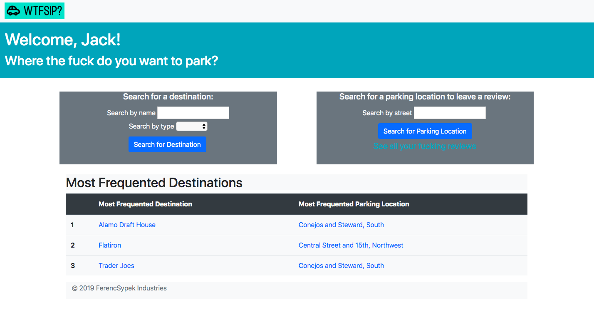

# Where the Fuck Should I Park?

WTFSIP? (Denver Edition) aggregates user-generated data for street parking surrounding frequently-visited destinations (restaurants, bars, and stores).  Users can filter street parking options to find the best place to park on a given day.

## Getting Started

`git clone`
`bundle install`
`rails s`

### Testing

RSpec

##Wireframe

## Authors

* **Jack Sypek**
* **Kari Ferenczy**

## Acknowledgments

* Hat tip

We'd like to thank Kyle for helping us with our domain modeling and Damon for helping us troubleshoot some styling issues.
